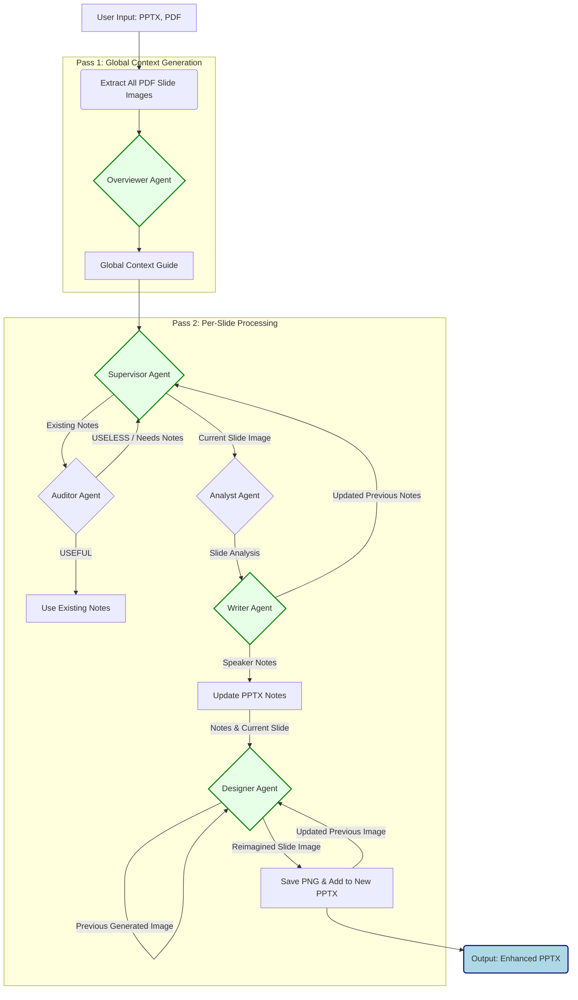

# Gemini Powerpoint Sage

This tool automatically generates or enhances speaker notes for PowerPoint presentations using a **Supervisor-led Multi-Agent System** powered by Google ADK. **Supports multi-language translation workflows** with English as baseline.

It takes a PowerPoint (`.pptx`) and its corresponding PDF export (`.pdf`) as input. The PDF provides visual context for AI analysis, while the PPTX is updated with generated speaker notes in one or multiple languages.

## Architecture
The system employs a sophisticated multi-agent approach, orchestrated in a two-pass system:

### Agents
1.  **Overviewer Agent (`gemini-3-pro-preview`, Pass 1):** This agent first analyzes *all* PDF slide images to generate a comprehensive `Global Context Guide`. This guide captures the overall narrative, key themes, vocabulary, and desired speaker persona for the entire presentation, ensuring consistency across all generated notes.
2.  **Supervisor Agent (`gemini-2.5-flash`, Pass 2 Orchestrator):** For each individual slide, the Supervisor directs the workflow. It decides whether to use existing notes (by consulting the Auditor), triggers the Analyst to understand the slide's content, and then requests the Writer to generate or refine speaker notes.
3.  **Auditor Agent (`gemini-2.5-flash`):** Evaluates the quality and usefulness of any existing speaker notes for a given slide.
4.  **Analyst Agent (`gemini-3-pro-preview`):** Analyzes the visual and textual content of a single slide image (from the PDF) to extract key topics, detailed information, visual descriptions, and the slide's intent.
5.  **Writer Agent (`gemini-2.5-flash`):** Crafts coherent, first-person speaker notes. It uses the insights from the Analyst, the `Global Context Guide` (from the Overviewer), and the `Previous Slide Summary` (from the Supervisor) to ensure smooth transitions and consistent tone.
6.  **Designer Agent (`gemini-3-pro-image-preview`):** Generates a new, high-fidelity, professional-looking slide image. It takes inspiration from the original slide (for branding like logos and colors) and critically, maintains style consistency by referencing the *previously generated slide image*. It converts speaker notes into concise on-slide text (Title + Bullet Points) and enhances any existing diagrams/charts.
7.  **Translator Agent (`gemini-2.5-flash`):** Translates speaker notes from English to target languages while maintaining technical accuracy, educational tone, and cultural appropriateness.
8.  **Image Translator Agent (`gemini-3-pro-image-preview`):** Analyzes English slide visuals and provides translations of text elements along with culturally adapted visual descriptions for regeneration in target languages.

### Additional Documentation

See the extended design rationale, sequence flows, and agent interface contracts in the full architecture guide: [ARCHITECTURE.md](docs/ARCHITECTURE.md).

### Workflow Diagram



## Key Features

- **🌍 Multi-Language Support**: Process presentations in multiple languages (en, zh-CN, yue-HK, es, fr, ja, ko, etc.) with English as baseline for translations
- **📁 Batch Processing**: Process entire folders of PPTX files with `--folder` parameter
- **🎨 AI Visual Generation**: Create professional slide designs with consistent styling
- **🎬 Video Prompt Generation**: Generate video prompts for each slide ready for Veo 3.1 video generation
- **💾 Organized Output**: Language-specific file naming (`filename_en_with_notes.pptx`, `filename_zh-CN_with_notes.pptx`)
- **⚡ Translation Mode**: Faster processing for non-English languages by translating from English baseline
- **📊 Progress Tracking**: Resume interrupted processing with automatic progress tracking per language

## Quick Start

```powershell
# Windows - Single file, English only
.\run.ps1 --pptx "lecture.pptx"

# Windows - Multiple languages (English + translations)
.\run.ps1 --pptx "lecture.pptx" --language "en,zh-CN,yue-HK"

# Windows - Batch process folder with multiple languages
.\run.ps1 --folder "presentations" --language "en,zh-CN"
```

```bash
# Linux/macOS - Single file, English only
./run.sh --pptx lecture.pptx

# Linux/macOS - Multiple languages
./run.sh --pptx lecture.pptx --language "en,zh-CN,yue-HK"
```

## Setup

### Quick Setup (Recommended)

#### Linux/macOS
```bash
./setup.sh
```

#### Windows
```powershell
.\setup.ps1
```

The setup script will:
- Create a Python virtual environment at `.venv`
- Install all required dependencies from `requirements.txt`
- Configure the environment for use

### Manual Setup
1.  Create a virtual environment:
    ```bash
    python3 -m venv .venv
    source .venv/bin/activate  # Linux/macOS
    # or
    .\.venv\Scripts\Activate.ps1  # Windows
    ```
2.  Install the required Python dependencies:
    ```bash
    pip install -r requirements.txt
    ```
3.  Ensure you have valid Google Cloud credentials configured for your environment (e.g., via `gcloud auth application-default login` or by setting `GOOGLE_APPLICATION_CREDENTIALS`).

## Usage

### Quick Start with Config File (Recommended)

The easiest way to run the tool is with a configuration file:

```bash
# 1. Copy the example config
cp config.example.yaml config.yaml

# 2. Edit config.yaml with your settings

# 3. Run with config file
python main.py --config config.yaml
```

See [CONFIG_FILE_GUIDE.md](CONFIG_FILE_GUIDE.md) for detailed configuration options.

### Linux/macOS
Run the `run.sh` script (it will automatically activate the virtual environment):

```bash
# With config file (recommended)
./run.sh --config config.yaml

# Basic usage - PDF auto-detected
./run.sh --pptx /path/to/presentation.pptx

# With explicit PDF
./run.sh --pptx /path/to/presentation.pptx --pdf /path/to/presentation.pdf

# With custom style
./run.sh --pptx /path/to/presentation.pptx --style "Gundam"

# Multiple languages
./run.sh --pptx /path/to/file.pptx --language "en,zh-CN,yue-HK"

# Folder mode
./run.sh --folder /path/to/presentations --language "en,zh-CN"
```

### Windows
Run the `run.ps1` PowerShell script (it will automatically activate the virtual environment):

```powershell
# With config file (recommended)
.\run.ps1 --config config.yaml

# Basic usage - PDF auto-detected
.\run.ps1 --pptx "C:\path\to\presentation.pptx"

# With explicit PDF
.\run.ps1 --pptx "C:\path\to\presentation.pptx" --pdf "C:\path\to\presentation.pdf"

# With custom style
.\run.ps1 --pptx "path\to\file.pptx" --style "Cyberpunk"

# Multiple languages
.\run.ps1 --pptx "path\to\file.pptx" --language "en,zh-CN,yue-HK"

# Generate video prompts for all slides
.\run.ps1 --pptx "path\to\file.pptx" --generate-videos

# Generate visuals and videos
.\run.ps1 --pptx "path\to\file.pptx" --generate-videos

# Folder mode
.\run.ps1 --folder "path\to\presentations" --language "en,zh-CN"

# Skip visual generation (faster)
.\run.ps1 --pptx "path\to\file.pptx" --skip-visuals

# Retry failed slides
.\run.ps1 --pptx "path\to\file.pptx" --retry-errors
```

### Process All Styles at Once

Generate multiple style variants automatically using all YAML configs in `styles/` directory:

```bash
# Linux/macOS (uses files from YAML configs)
./run_all_styles.sh

# Python (cross-platform)
python run_all_styles.py

# Windows PowerShell
.\run_all_styles.ps1

# With specific language
./run_all_styles.sh zh-CN
```

This processes the presentation with all style configurations, creating organized outputs:
```
cyberpunk/generate/presentation_en_notes.pptx
gundam/generate/presentation_en_notes.pptx
star_wars/generate/presentation_en_notes.pptx
professional/generate/presentation_en_notes.pptx
```

**Note:** Language code is always included in filenames (e.g., `_en_`, `_zh-CN_`).

**Note:** PPTX and PDF paths are read from each YAML config file.

See [RUN_ALL_STYLES.md](docs/RUN_ALL_STYLES.md) for detailed documentation.

### Environment Variables (Optional)

```powershell
# Windows - Use alternate GCP project
$env:GOOGLE_CLOUD_PROJECT = 'your-project-id'
$env:GOOGLE_CLOUD_LOCATION = 'us-central1'
.\run.ps1 --pptx "path\to\file.pptx"
```

```bash
# Linux/macOS - Use alternate GCP project
export GOOGLE_CLOUD_PROJECT='your-project-id'
export GOOGLE_CLOUD_LOCATION='us-central1'
./run.sh --pptx /path/to/file.pptx
```

## Command-Line Arguments

**Required (one of):**
*   `--pptx <path>` - Path to input PowerPoint file
*   `--folder <path>` - Path to folder with multiple PPTX files

**Optional:**
*   `--pdf <path>` - Path to PDF export (auto-detected if not specified)
*   `--language <locale(s)>` - Language codes, comma-separated (default: `en`)
    - Examples: `en`, `zh-CN`, `"en,zh-CN,yue-HK"`
    - English always processed first as translation baseline
    - Supported: en, zh-CN, zh-TW, yue-HK, es, fr, ja, ko, de, it, pt, ru, ar, hi, th, vi
*   `--course-id <id>` - Firestore Course ID for thematic context
*   `--progress-file <path>` - Custom progress file location
*   `--retry-errors` - Retry previously failed slides
*   `--skip-visuals` - Skip AI visual generation (notes only, faster)
*   `--generate-videos` - Generate video prompts for all slides (requires Veo 3.1 for actual video generation)
*   `--region <region>` - GCP region (default: global)
*   `--refine <path>` - Refine an existing progress JSON file for TTS (removes markdown, simplifies text)

## Multi-Language Translation Workflow

### How It Works

1. **English Baseline** - Always processed first from slide analysis
2. **Speaker Note Translation** - Other languages translate from English notes using dedicated Translator agent (bypasses supervisor/analyst for speed)
3. **Visual Translation** - Image Translator Agent analyzes English visuals, Designer Agent regenerates with translated text in target language
4. **Organized Output** - All files include language suffix: `filename_{locale}_*`

### Example

```powershell
.\run.ps1 --pptx "lecture.pptx" --language "en,zh-CN,yue-HK"
```

**Output:**
```
lecture_en_with_notes.pptx       # English (generated)
lecture_en_progress.json
lecture_en_visuals/              # Generated visuals
lecture_zh-CN_with_notes.pptx    # Simplified Chinese (translated)
lecture_zh-CN_progress.json
lecture_zh-CN_visuals/           # Translated visuals (text in Chinese)
lecture_yue-HK_with_notes.pptx   # Cantonese (translated)
lecture_yue-HK_progress.json
lecture_yue-HK_visuals/          # Translated visuals (text in Cantonese)
```

### Benefits
- ⚡ **Faster**: Translation faster than full generation
- 💰 **Cost-effective**: Fewer API calls for additional languages (2 calls vs 4-5 calls per slide)
- 🌍 **Localized**: Text in visuals translated to target language
- 📐 **Design Consistency**: Layout and style maintained across languages
- 🎯 **Consistent**: All versions based on same English baseline
- ✅ **Quality**: English serves as reviewed baseline

## Refining Speaker Notes (TTS Optimization)

You can refine existing generated speaker notes to be optimized for **Text-to-Speech (TTS)** systems. This process:
*   Removes markdown formatting (bold, italics, headers)
*   Simplifies complex sentence structures
*   Converts bullet points into natural conversational flow
*   Removes visual references (e.g., "As you can see in this chart")

**Usage:**
```bash
# Single file
./run.sh --refine path/to/progress.json

# Batch process folder (refines all .json files in folder)
./run.sh --refine path/to/folder/
```

**Output:**
Creates a new file with the `_refined.json` suffix (e.g., `progress_refined.json`) for each processed file.

## Output Files

The tool generates **self-contained output folders** with all files per language/style:

**Generated files per language:**
1. **`{filename}_{locale}_with_notes.pptx`**: Original slides with updated/generated speaker notes
2. **`{filename}_{locale}_with_visuals.pptx`**: Slides with both speaker notes and AI-generated visuals (unless `--skip-visuals` is used)
3. **`{filename}_{locale}_progress.json`**: Progress tracking for incremental processing (always included)
4. **`{filename}_{locale}_visuals/`**: Directory containing AI-generated slide images (PNG files)

**Example structure (single file):**
```
presentations/
├── lecture.pptx (original)
├── lecture.pdf (original)
├── lecture_en_with_notes.pptx
├── lecture_en_with_visuals.pptx
├── lecture_en_progress.json          # Self-contained progress tracking
├── lecture_en_visuals/
│   ├── slide_1_reimagined.png
│   └── slide_2_reimagined.png
├── lecture_zh-CN_with_notes.pptx
├── lecture_zh-CN_with_visuals.pptx
├── lecture_zh-CN_progress.json       # Self-contained progress tracking
└── lecture_zh-CN_visuals/
    ├── slide_1_reimagined.png
    └── slide_2_reimagined.png
```

**Example structure (with styles):**
```
output/
├── cyberpunk/
│   └── generate/
│       ├── lecture_en_notes.pptx
│       ├── lecture_en_visuals.pptx
│       ├── lecture_en_progress.json  # Self-contained
│       └── lecture_en_visuals/
├── gundam/
│   └── generate/
│       ├── lecture_en_notes.pptx
│       ├── lecture_en_visuals.pptx
│       ├── lecture_en_progress.json  # Self-contained
│       └── lecture_en_visuals/
└── star_wars/
    └── generate/
        ├── lecture_en_notes.pptx
        ├── lecture_en_visuals.pptx
        ├── lecture_en_progress.json  # Self-contained
        └── lecture_en_visuals/
```

**Note:** Language code (`en`, `zh-CN`, etc.) is always included in all filenames.

**Each output folder is self-contained** - you can move, share, or archive any folder independently with all its progress data intact.

## Progress Tracking & Resume

The tool automatically tracks processing progress for each language:

- **Incremental processing**: Interrupted work can be resumed without reprocessing completed slides
- **Error retry**: Failed slides automatically retried on subsequent runs
- **Force retry**: Use `--retry-errors` to regenerate all slides including successful ones
- **Language isolation**: Each language has independent progress tracking

Progress files track:
- Slide index and original notes hash
- Generated speaker notes
- Processing status (success/error)
- Global context for consistency

## Batch Processing

Process multiple PPTX files at once:

```powershell
.\run.ps1 --folder "presentations" --language "en,zh-CN"
```

**Features:**
- Auto-discovers all `.pptx` files in folder
- Auto-detects matching PDF files (same basename)
- Skips files without PDFs
- Independent progress tracking per file and language
- Continues on individual file failures
- Processes all languages for each file before moving to next

**More details**: See [docs/FOLDER_STRUCTURE.md](docs/FOLDER_STRUCTURE.md)

## Technical Implementation Details

### Supervisor "Silent Finish" Fallback
A common issue in Agentic workflows is the "Silent Finish," where a Supervisor agent calls a tool (e.g., `speech_writer`), receives the correct text output, but then terminates the turn without explicitly repeating that text to the user.

To solve this, we implement a **Last Tool Output Fallback** pattern:
1.  The `speech_writer` tool function captures its generated text into a scoped variable (`last_writer_output`) every time it runs successfully.
2.  If the Supervisor loop finishes execution but produces **empty** final text, the system checks if `last_writer_output` contains data.
3.  If yes, the system infers that the Supervisor intended to return this content and uses the captured text as the final speaker note.

This ensures robustness against model unpredictability, especially with faster models like `gemini-2.5-flash`.

### Image Generation Skip Logic
*   **Stable Caching:** Generated images named `slide_{index}_reimagined.png`
*   **Skip Check:** Checks if image exists before calling Image Generation API
*   **Forced Retry:** `--retry-errors` flag bypasses cache to force regeneration
*   **Language-Specific:** Each language has its own visuals directory

### Translation Mode
*   **English First:** Always generates English from scratch as baseline
*   **Translation:** Non-English languages translate from English notes
*   **Consistency:** Ensures all language versions convey same content
*   **Performance:** Translation 2-3x faster than full generation

## Additional Documentation

- **[ARCHITECTURE.md](docs/ARCHITECTURE.md)** - Detailed system design and agent workflows
- **[FOLDER_STRUCTURE.md](docs/FOLDER_STRUCTURE.md)** - Complete guide to multi-language file organization
- **[CHANGELOG.md](CHANGELOG.md)** - Version history and feature updates

## Context Handling
*   **Rolling Context:** The Supervisor Agent maintains a "rolling context" by being aware of the previous slide's generated note. This helps in creating smooth transitions between slides.
*   **Presentation Theme:** The overall theme of the presentation is either a generic default or derived from the `--course-id` (if provided), helping agents align their output with the subject matter.
*   **Global Context:** The Overviewer Agent analyzes all slides first to create a comprehensive context guide that ensures consistency across all generated notes.
├── lecture1_en_visuals/
│   ├── slide_1_reimagined.png
│   └── slide_2_reimagined.png
├── lecture1_zh-CN_progress.json        # Simplified Chinese (translated)
├── lecture1_zh-CN_with_notes.pptx
├── lecture1_zh-CN_with_visuals.pptx
├── lecture1_zh-CN_visuals/
│   ├── slide_1_reimagined.png          # Copied/translated from English
│   └── slide_2_reimagined.png
├── lecture1_yue-HK_progress.json       # Cantonese (translated)
├── lecture1_yue-HK_with_notes.pptx
└── lecture1_yue-HK_visuals/
    └── slide_1_reimagined.png
```

### Batch Processing (Folder Mode)
Process multiple PPTX files in a folder with a single command:

```powershell
# Single language
.\run.ps1 --folder "path\to\presentations" --language en

# Multiple languages (English baseline + translations)
.\run.ps1 --folder "path\to\presentations" --language "en,zh-CN,yue-HK"
```

**Features:**
*   Automatically finds all `.pptx` files in the specified folder
*   Attempts to locate matching PDF files (same basename)
*   Skips files without corresponding PDFs
*   Each file gets its own progress tracking and visuals directory
*   Continues processing remaining files if one fails
*   Reports summary of processed files at completion

**Requirements:**
*   Each PPTX must have a corresponding PDF with the same base filename in the same folder
*   Files starting with `~$` (temporary files) are automatically skipped

## Context Handling
*   **Rolling Context:** The Supervisor Agent maintains a "rolling context" by being aware of the previous slide's generated note. This helps in creating smooth transitions between slides.
*   **Presentation Theme:** The overall theme of the presentation is either a generic default or derived from the `--course-id` (if provided), helping agents align their output with the subject matter.


## 📚 Documentation

Comprehensive documentation is available in the `docs/` folder:

### Quick Start
- **[Quick Start Guide](docs/QUICK_START.md)** - Get started in 3 easy steps
- **[Configuration File Guide](docs/CONFIG_FILE_GUIDE.md)** - Use YAML/JSON config files
- **[Style Examples](docs/STYLE_EXAMPLES.md)** - Apply custom themes (Gundam, Cyberpunk, etc.)

### Reference
- **[Folder Structure](docs/FOLDER_STRUCTURE.md)** - Understand output organization
- **[Quick Reference](docs/QUICK_REFERENCE.md)** - Command-line reference

### Architecture
- **[Architecture](docs/ARCHITECTURE.md)** - System architecture overview
- **[Refactored Architecture](docs/REFACTORED_ARCHITECTURE.md)** - Improved design

**Full documentation index:** [docs/README.md](docs/README.md)

## 🎨 Configuration Files

Instead of long command lines, use configuration files:

```bash
# 1. Copy example
cp config.example.yaml config.yaml

# 2. Edit config.yaml with your settings

# 3. Run
python main.py --config config.yaml
```

See [Configuration File Guide](docs/CONFIG_FILE_GUIDE.md) for details.

## 🎭 Custom Styles

Apply themed styles to your presentations using pre-configured YAML files:

```bash
# Star Wars - Epic space opera with Jedi Master narration
./run.sh --config config.starwars.yaml

# Gundam - Mecha anime with dramatic Char Aznable-style speeches
./run.sh --config config.gundam.yaml

# Cyberpunk - Neon-soaked dystopian aesthetic
./run.sh --config config.cyberpunk.yaml

# Or use inline styles
python main.py --pptx file.pptx --style "Minimalist"
```

**Available Style Configs:**
- 🌌 **Star Wars** - Jedi briefings with epic space opera visuals
- 🤖 **Gundam** - Mecha anime aesthetic with philosophical antagonist voice
- 🌃 **Cyberpunk** - Neon colors with edgy tech-savvy narration
- 📋 **Sample** - Professional and clean default style

See [Style Configuration Gallery](docs/STYLE_CONFIGS.md) for detailed descriptions and how to create your own.
