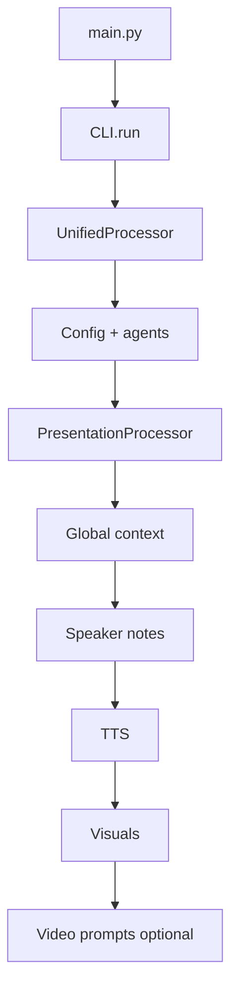

# Gemini PowerPoint Sage

🤖 **AI-powered presentation enhancement system using 10 specialized Gemini agents** to generate speaker notes, enhance visuals, and apply custom styles. Supports 16+ languages with batch processing and themed styling (Cyberpunk, Gundam, Star Wars, etc.).

Transforms static PowerPoint presentations into engaging experiences with AI-generated speaker scripts, enhanced visuals, and professional styling. Uses a sophisticated **Supervisor-led Multi-Agent Architecture** with Google Gemini models for intelligent content generation and style integration.

## 📚 Documentation

- **[Quick Start](docs/QUICK_START.md)** - Get running in 3 steps
- **[User Guide](QUICK_REFERENCE.md)** - Commands, styles, and workflows  
- **[Architecture Trace](docs/ARCHITECTURE.md)** - Runtime flow from CLI to slide processing
- **[All Documentation](docs/README.md)** - Complete documentation index

## ✅ Pick the simplest command

| Goal | Command |
| --- | --- |
| Process one built-in style config | `python main.py --style-config professional` |
| Process one arbitrary YAML config | `python main.py --config /path/to/config.yaml` |
| Process every configured style | `python main.py --styles` |

`python main.py` defaults to `--styles`.

## 🏗️ Architecture

The system uses a sophisticated **10-Agent Multi-Agent Architecture** with three processing phases:


```mermaid
flowchart TD
    A[main.py] --> B[CLI.run]
    B --> C[UnifiedProcessor]
    C --> D[Config + agents]
    D --> E[PresentationProcessor]
    E --> F[Global context]
    F --> G[Speaker notes]
    G --> H[TTS]
    H --> I[Visuals]
    I --> J[Video prompts optional]
```

For the full trace, see [docs/ARCHITECTURE.md](docs/ARCHITECTURE.md).

### 🤖 The Agent Ecosystem

1. **Overviewer Agent** (`gemini-3-pro-preview`): Analyzes entire presentation for global context and narrative consistency
2. **Supervisor Agent** (`gemini-2.5-flash`): Orchestrates 5-step workflow for each slide, coordinating other agents
3. **Auditor Agent** (`gemini-2.5-flash`): Quality control - evaluates existing content and determines if regeneration is needed
4. **Analyst Agent** (`gemini-3-pro-preview`): Visual content analysis - extracts insights from slide images
5. **Writer Agent** (`gemini-2.5-flash`): Generates natural, engaging speaker scripts with style integration
6. **Designer Agent** (`gemini-3-pro-image-preview`): Creates enhanced slide visuals with consistent styling
7. **Translator Agent** (`gemini-2.5-flash`): Style-aware translation maintaining persona and technical accuracy
8. **Image Translator Agent** (`gemini-3-pro-image-preview`): Analyzes and translates visual content for different languages
9. **Video Generator Agent** (`gemini-2.5-flash`): Creates video prompts ready for Veo 3.1 integration
10. **Prompt Rewriter Agent** (`gemini-2.5-flash`): Meta-agent that integrates styles into other agents' prompts at creation time

### 📋 Three-Phase Processing

**Phase 1: Speaker Notes Generation**
- Global context analysis by Overviewer
- Per-slide supervisor workflow (Audit → Analyze → Write)
- Translation mode for non-English languages

**Phase 2: Visual Enhancement** 
- AI-generated slide designs with style consistency
- Visual translation for multilingual presentations
- Layout optimization and professional styling

**Phase 3: Video Content** (Optional)
- Video prompt generation for promotional content
- MCP integration with Veo 3.1
- Slide-appropriate timing and concepts


## ✨ Key Features

- 🤖 **10 Specialized AI Agents** working in harmony for comprehensive presentation enhancement
- 🌍 **16+ Languages** with cultural adaptation (en, zh-CN, zh-TW, yue-HK, es, fr, ja, ko, de, it, pt, ru, ar, hi, th, vi)
- 🎨 **Custom Themed Styles** (Cyberpunk, Gundam, Star Wars, Professional, HK Comic) affecting both visuals and speaker persona
- 📁 **Batch Processing** for entire presentation libraries with YAML-driven configuration
- ⚡ **Translation Mode** 2-3x faster than full generation by translating from English baseline
- 🎬 **Video Integration** ready for Veo 3.1 with professional video concepts
- 🎥 **Video Synthesis** with intelligent caching - combines slides + audio into presentation videos (2-5x faster reruns)
- 📊 **Progress Tracking** with resume capability and error retry
- 🛠️ **Production Ready** with robust error handling and fallback mechanisms
- 🎯 **Style Integration** via Prompt Rewriter agent that deeply integrates themes into all agents
- 💾 **Self-Contained Output** with organized language-specific folders
- 🚀 **High-Performance Caching** with file-based prompt caching reducing processing time from 110s to <1s
- 🎙️ **Advanced TTS Support** with Gemini TTS integration, intelligent timeout handling, and tone validation

## 🚀 Quick Start

Choose from three YAML-first processing modes:

```bash
# 🌟 All Styles Processing (Production - Process all files with all style configurations)
python main.py --styles
python main.py  # defaults to --styles

# 🎨 Single Style Processing (Focused - Process all files with one specific style)
python main.py --style-config cyberpunk
python main.py --style-config professional
python main.py --style-config gundam

# 🧩 Direct Config Processing (Use a custom YAML file directly)
python main.py --config /path/to/custom-config.yaml

# Example one-presentation YAML run
python main.py --config configs/lecture.yaml
```

```powershell
# Windows PowerShell
python main.py --styles
python main.py --style-config starwars
python main.py --config ".\configs\lecture.yaml"
```

## Setup

### Quick Setup (Recommended)

```bash
# Linux/macOS
./setup.sh

# Windows
.\setup.ps1
```

The setup script will:
- Create a Python virtual environment at `.venv`
- Install all required dependencies
- Configure the environment

### Manual Setup

```bash
# Create virtual environment
python3 -m venv .venv
source .venv/bin/activate  # Linux/macOS
# or
.\.venv\Scripts\Activate.ps1  # Windows

# Install dependencies
pip install -r requirements.txt

# Configure Google Cloud credentials
gcloud auth application-default login
```

## Google Cloud Project Rotation

To avoid hitting API quota limits when processing large presentations, you can configure multiple Google Cloud projects for automatic load balancing:

```bash
# .env file
# Single project (default)
GOOGLE_CLOUD_PROJECT=your-project-id

# Multiple projects for load balancing (recommended for large workloads)
GOOGLE_CLOUD_PROJECTS=project-id-1,project-id-2,project-id-3
```

The system automatically rotates through projects for each slide, visual, and TTS generation, distributing the load evenly. See [docs/PROJECT_ROTATION.md](docs/PROJECT_ROTATION.md) for details.

## Usage

### Processing Modes

#### 🌟 All Styles Processing (Production)
Process all `styles/config.*.yaml` configurations:

```bash
# Process every YAML config found in styles/
python main.py --styles
python main.py  # defaults to --styles

# Each config file controls:
# - input_folder / pptx: what to process
# - output_dir: where to save results
# - language: languages to process
# - style: visual and speaker style definitions
```

#### 🎨 Single Style Processing (Focused)
Process all files with one specific style configuration:

```bash
# Process with cyberpunk style only
python main.py --style-config cyberpunk

# Process with professional style only
python main.py --style-config professional

# Prefer --config for arbitrary config paths
python main.py --config /path/to/custom-config.yaml
```

#### 🧩 Direct Config Processing
Process a YAML config without treating it as a named built-in style:

```bash
python main.py --config /path/to/config.yaml
```

### Utility Modes

Processing behavior comes from YAML. CLI flags are only for standalone utility modes:

```bash
# Generate TTS from an existing progress JSON
python main.py --tts-only --progress-file output/presentation_en_progress.json

# Synthesize presentation video from slides + audio
python main.py --synthesize-video \
  --slides-dir notes/cyberpunk/generate/presentation_en_visuals \
  --video-output output/presentation.mp4

# Video synthesis with custom configuration
python main.py --synthesize-video \
  --slides-dir visuals/ \
  --video-output video_hd.mp4 \
  --video-config '{"resolution": [1280, 720], "video_bitrate": "1.5M"}'
```

### YAML Configuration Structure

All organized processing uses YAML configuration files in the `styles/` directory:

```yaml
# styles/config.cyberpunk.yaml
input_folder: "notes"                    # Where to find PPTX/PDF pairs
output_dir: "notes/cyberpunk/generate"   # Where to save results
language: "en,zh-CN,yue-HK"             # Languages to process
style:
  visual_style: "Cyberpunk aesthetic with neon colors..."
  speaker_style: "Night City edgerunner persona..."
skip_visuals: false
generate_videos: false
```

**Available Style Configurations:**
- `styles/config.cyberpunk.yaml` - 🌃 Neon-soaked Night City edgerunner aesthetic with anti-corpo attitude
- `styles/config.professional.yaml` - 📋 Clean, corporate design with authoritative tone
- `styles/config.gundam.yaml` - 🤖 Mecha anime aesthetic with philosophical antagonist voice
- `styles/config.starwars.yaml` - 🌌 Epic space opera with Jedi Master narration
- `styles/config.hkcomic.yaml` - 🎨 Vibrant Hong Kong comic book style with dynamic energy

## Command-Line Arguments

### Processing Modes (choose one)

**YAML-Driven Processing:**
- `--styles` - Process all files with all available YAML configurations (default)
- `--style-config <name>` - Process all files with one specific YAML configuration
  - Examples: `cyberpunk`, `professional`, `gundam`
  - Prefer `--config` for arbitrary file paths
- `--config <path>` - Process one explicit YAML config file

### YAML-Owned Processing Options

These settings now belong in YAML, not on the processing CLI:

- `pptx` / `pdf`
- `input_folder`
- `output_dir`
- `language`
- `style`
- `course_id`
- `retry_errors`
- `skip_visuals`
- `generate_videos`
- `region`
- `progress_file`

### Utility Options

- `--progress-file <path>` - Progress JSON input for `--tts-only`
- `--refine <path>` - Refine existing progress JSON for TTS (removes markdown)

### Video Synthesis Options
- `--synthesize-video` - Create presentation video from slides and audio
- `--slides-dir <path>` - Directory containing slide images (PNG/JPG)
- `--audio-dir <path>` - Directory containing audio files (MP3) - optional if same as slides-dir
- `--video-output <path>` - Output path for synthesized video file
- `--video-config <config>` - Video configuration (JSON string or file path)
- `--video-cache-stats` - Show video synthesis cache statistics
- `--video-clear-cache <days>` - Clear video cache (0 = all, N = older than N days)

## 🎭 Custom Themed Styles

Transform your presentations with AI-powered themed styles that affect both visuals and speaker persona:

```bash
# Process all styles at once (recommended for production)
python main.py --styles

# Process one specific style configuration
python main.py --style-config starwars
python main.py --style-config gundam
python main.py --style-config cyberpunk
python main.py --style-config hkcomic
python main.py --style-config professional

# One explicit YAML config per run
python main.py --config configs/starwars-demo.yaml
python main.py --config configs/cyberpunk-multilang.yaml
```

### 🎨 Available Themed Styles

- 🌌 **Star Wars** - Epic space opera with Jedi Master narration and galactic visuals
- 🤖 **Gundam** - Mecha anime aesthetic with philosophical antagonist voice and dramatic speeches  
- 🌃 **Cyberpunk** - Night City edgerunner persona with neon-soaked dystopian visuals and anti-corpo attitude
- 🎨 **HK Comic** - Vibrant Hong Kong comic book style with dynamic energy and bold colors
- 📋 **Professional** - Clean, corporate design with authoritative tone and business-focused approach

### 🔧 Style Integration System

Each style deeply integrates into the AI agents through the **Prompt Rewriter Agent**:

- **Visual Style**: Affects Designer agent for consistent slide aesthetics, color palettes, typography, and layout
- **Speaker Style**: Affects Writer and Translator agents for persona, vocabulary, tone, and cultural references
- **Deep Integration**: Styles are woven throughout prompts, not just appended, for natural and cohesive results

**Style Configuration Structure:**
```yaml
# styles/config.{style}.yaml
input_folder: "notes"                    # Source PPTX/PDF location
output_dir: "notes/{style}/generate"     # Organized output by style
language: "en,zh-CN,yue-HK"             # Languages to process
style:
  visual_style: |                       # Detailed visual aesthetic guide
    Color palettes, typography, layout principles...
  speaker_style: |                      # Detailed speaker persona guide
    Tone, vocabulary, cultural references, roleplay instructions...
```

See the `styles/` directory for complete configuration examples and create your own custom styles.

## 🎥 Video Synthesis

Transform your presentations into engaging videos by combining slide images with AI-generated audio narration.

### Quick Start

```bash
# 1. First, generate presentation with visuals and TTS
./run.sh --style-config cyberpunk

# 2. Synthesize video from generated slides and audio
python main.py --synthesize-video \
  --slides-dir notes/cyberpunk/generate/presentation_en_visuals \
  --video-output output/presentation.mp4
```

### Video Synthesis Features

- **🚀 Intelligent Caching**: 2-5x faster reruns by caching video segments
- **⚙️ Flexible Configuration**: Multiple quality presets (HD, 4K, web-optimized)
- **📁 Same Directory Support**: Slides and audio in same folder for simplified workflow
- **🎛️ Custom Settings**: JSON configuration for resolution, codecs, bitrates
- **🧹 Cache Management**: CLI commands for monitoring and cleaning cache

### Configuration Examples

**Basic video synthesis:**
```bash
python main.py --synthesize-video \
  --slides-dir path/to/visuals \
  --video-output presentation.mp4
```

**HD with custom settings:**
```bash
python main.py --synthesize-video \
  --slides-dir path/to/visuals \
  --video-output video_hd.mp4 \
  --video-config '{"resolution": [1280, 720], "video_bitrate": "1.5M"}'
```

**4K high quality:**
```bash
python main.py --synthesize-video \
  --slides-dir path/to/visuals \
  --video-output video_4k.mp4 \
  --video-config '{"resolution": [3840, 2160], "video_bitrate": "8M"}'
```

### Cache Management

**View cache statistics:**
```bash
python main.py --video-cache-stats
```

**Clear cache:**
```bash
# Clear all cached segments
python main.py --video-clear-cache 0

# Clear segments older than 7 days
python main.py --video-clear-cache 7
```

### Performance Benefits

| Scenario | First Run | Cached Run | Speedup |
|----------|-----------|------------|---------|
| 5 slides | 45 seconds | 12 seconds | 3.8x |
| 20 slides | 3 minutes | 45 seconds | 4.0x |
| 50 slides | 12 minutes | 2 minutes | 6.0x |

**Cache Location**: `./cache/video_synthesis/`

For detailed information, see [Video Synthesis Setup Guide](VIDEO_SYNTHESIS_SETUP.md) and [Caching Guide](CACHING_GUIDE.md).

## Multi-Language Translation Workflow

### How It Works

1. **English Baseline** - Always processed first from slide analysis with configured speaker style
2. **Style-Aware Translation** - Other languages translate AND restyle from English notes, applying the target language's speaker style configuration
3. **Visual Translation** - Image Translator analyzes English visuals, Designer regenerates with translated text
4. **Organized Output** - All files include language suffix: `filename_{locale}_*`

### Example

```bash
# Use YAML for one custom presentation run
python main.py --config configs/lecture.yaml

# Or use a built-in style config
python main.py --style-config professional
```

**Output:**
```
lecture_en_with_notes.pptx       # English (generated)
lecture_en_with_visuals.pptx
lecture_en_progress.json
lecture_en_visuals/              # Generated visuals

lecture_zh-CN_with_notes.pptx    # Simplified Chinese (translated)
lecture_zh-CN_with_visuals.pptx
lecture_zh-CN_progress.json
lecture_zh-CN_visuals/           # Translated visuals

lecture_yue-HK_with_notes.pptx   # Cantonese (translated)
lecture_yue-HK_with_visuals.pptx
lecture_yue-HK_progress.json
lecture_yue-HK_visuals/
```

### Benefits

- ⚡ **Faster**: Translation 2-3x faster than full generation
- 💰 **Cost-effective**: Fewer API calls (2 vs 4-5 calls per slide)
- 🌍 **Localized**: Text in visuals translated to target language
- 📐 **Design Consistency**: Layout and style maintained across languages
- 🎯 **Consistent**: All versions based on same English baseline
- 🎭 **Style-Aware**: Each language applies its configured speaker style during translation
- ✅ **Quality**: English serves as reviewed baseline

## Output Files

The tool generates self-contained output folders with all files per language/style:

**Generated files per language:**
1. `{filename}_{locale}_with_notes.pptx` - Original slides with speaker notes
2. `{filename}_{locale}_with_visuals.pptx` - Slides with notes and AI-generated visuals
3. `{filename}_{locale}_progress.json` - Progress tracking for incremental processing
4. `{filename}_{locale}_visuals/` - Directory containing AI-generated slide images (PNG)
5. `{filename}_{locale}_speech/` - Directory containing TTS audio files (MP3)
6. `{filename}_{locale}_segments/` - Directory containing cached video segments (MP4)

### File Naming Logic

The system uses systematic naming conventions for organization and caching:

- **Language Suffixes**: All files include language codes (`_en`, `_zh-CN`, `_yue-HK`)
- **Content Hashes**: Audio files include content hashes for cache invalidation (`slide_1_abc123.mp3`)
- **Natural Sorting**: Slide numbers sort correctly (`slide_1.png`, `slide_2.png`, ..., `slide_10.png`)
- **1:1:1 Correspondence**: Strict pairing between slides, audio, and video segments

**See [File Naming Conventions](docs/FILE_NAMING_CONVENTIONS.md) for complete details.**

**Example structure (single-presentation YAML config):**
```
presentations/
├── lecture.pptx (original)
├── lecture.pdf (original)
├── lecture_en_with_notes.pptx
├── lecture_en_with_visuals.pptx
├── lecture_en_progress.json
├── lecture_en_visuals/
│   ├── slide_1_reimagined.png
│   └── slide_2_reimagined.png
├── lecture_zh-CN_with_notes.pptx
├── lecture_zh-CN_with_visuals.pptx
├── lecture_zh-CN_progress.json
└── lecture_zh-CN_visuals/
    ├── slide_1_reimagined.png
    └── slide_2_reimagined.png
```

**Example structure (YAML-driven processing):**
```
# Single style processing: python main.py --style-config cyberpunk
notes/cyberpunk/generate/
├── lecture_en_notes.pptm
├── lecture_en_visuals.pptm
├── lecture_en_progress.json
└── lecture_en_visuals/

# All styles processing: python main.py --styles
notes/
├── cyberpunk/generate/
│   ├── lecture_en_notes.pptm
│   ├── lecture_en_visuals.pptm
│   ├── lecture_en_progress.json
│   └── lecture_en_visuals/
├── gundam/generate/
│   ├── lecture_en_notes.pptm
│   ├── lecture_en_visuals.pptm
│   ├── lecture_en_progress.json
│   └── lecture_en_visuals/
└── professional/generate/
    ├── lecture_en_notes.pptm
    ├── lecture_en_visuals.pptm
    ├── lecture_en_progress.json
    └── lecture_en_visuals/
```

**Note:** Each output folder is self-contained - you can move, share, or archive any folder independently.

## Progress Tracking & Resume

The tool automatically tracks processing progress for each language:

- **Incremental processing**: Resume interrupted work without reprocessing completed slides
- **Error retry**: Failed slides automatically retried on subsequent runs
- **Force retry**: Set `retry_errors: true` in YAML to regenerate failed slides on the next run
- **Language isolation**: Each language has independent progress tracking

Progress files track:
- Slide index and original notes hash
- Generated speaker notes
- Processing status (success/error)
- Global context for consistency

## 🚨 Error Handling & Dependencies

The system uses a **strict dependency chain** where each phase requires the previous phase to succeed:

### Processing Dependencies

| Phase | Depends On | What Happens When Previous Phase Fails |
|-------|------------|---------------------------------------|
| **Speaker Notes** | PDF content, existing notes | ❌ Status = "error", empty/failed content |
| **Image Generation** | ✅ **Speaker notes success** | ❌ **SKIPPED** - "due to notes generation failure" |
| **MP3/TTS Generation** | ✅ **Speaker notes success** + non-empty content | ❌ **SKIPPED** - not added to processing queue |
| **Video Generation** | ✅ **Speaker notes success** | ❌ **SKIPPED** - "status != success" |
| **Video Synthesis** | ✅ **All slides successful** | ❌ **ABORTED** - "slide-audio count mismatch" |

### Critical Rules

1. **Speaker Notes are Foundation**: If speaker notes fail for any slide, ALL downstream processes are skipped for that slide
2. **Video Synthesis Requires ALL Slides**: Missing any slide breaks the entire video synthesis process
3. **Strict 1:1 Pairing**: Video synthesis requires exactly matching numbers of slide images and audio files
4. **Sequence Alignment**: Missing slide 16 means slide 17's image gets paired with slide 16's audio (misalignment)

### Error Recovery

**Automatic Retry with `retry_errors: true`:**
```yaml
# In styles/config.*.yaml
retry_errors: true  # Force regeneration of failed slides
```

**Retry by changing YAML:**
```yaml
retry_errors: true
```

### Common Error Scenarios

**Scenario 1: Single Slide Failure**
- Slide 16 speaker notes fail → Slide 16 gets no image, no audio, no video
- Video synthesis fails: "45 images vs 45 audio files" (missing slide 16)
- **Solution**: Fix slide 16 with `retry_errors: true`

**Scenario 2: Multiple Slide Failures**
- Slides 5, 12, 23 fail → Missing 3 slides from all downstream processes
- Video synthesis fails: "43 images vs 43 audio files" but misaligned pairing
- **Solution**: Fix all failed slides before attempting video synthesis

**Scenario 3: Partial Recovery**
- Some slides succeed on retry, others still fail
- Video synthesis still fails until ALL slides succeed
- **Solution**: Continue retrying until 100% success rate

For detailed troubleshooting, see [Error Handling Guide](docs/ERROR_HANDLING.md).

### Quick Troubleshooting

**❌ Video synthesis fails with "slide-audio count mismatch"**
```bash
# Check for failed slides
grep -r "status.*error" notes/*/generate/*.json

# Fix failed slides
# 1. Set retry_errors: true in the affected YAML config(s)
# 2. Re-run the config
python main.py --styles

# Verify all slides successful before video synthesis
python main.py --video-cache-stats
```

**❌ Some slides show "status": "error"**
```bash
# Enable retry mode in YAML config
retry_errors: true

# Re-run the YAML config after setting retry_errors: true
python main.py --style-config cyberpunk
```

**❌ Slides marked "success" but contain error messages (Fixed in v2.1+)**
```bash
# Symptoms: "status": "success" but note contains "Error: The writer agent failed..."
# This was a critical bug - tool errors were misclassified as successful

# Solution: System now uses structured error format and intelligent detection
# New format: "SYSTEM_ERROR: SPEECH_WRITER - Tool returned error message"
# Affected slides will be properly marked as "error" and retried automatically
```

**❌ "Skipping visual generation due to notes generation failure"**
```bash
# Root cause: Speaker notes failed first
# Fix speaker notes, then images will generate automatically
# Set retry_errors: true in YAML, then rerun
python main.py --style-config cyberpunk
```

## Batch Processing

The system automatically processes multiple PPTX files using YAML configurations:

```bash
# Process all files with all styles
python main.py --styles

# Process all files with one specific style
python main.py --style-config cyberpunk
```

**How it works:**
- YAML configs specify `input_folder` (e.g., "notes") containing PPTX/PDF pairs
- Auto-discovers all `.pptx` files in the specified folder
- Auto-detects matching PDF files (same basename)
- Skips files without PDFs with warning
- Independent progress tracking per file and language
- Continues on individual file failures
- Processes all languages for each file before moving to next

**Directory Structure:**
```
notes/                          # input_folder from YAML
├── module1.pptx
├── module1.pdf
├── module2.pptx
├── module2.pdf
└── module3.pptx
└── module3.pdf

notes/cyberpunk/generate/       # output_dir from YAML
├── module1_en_notes.pptm
├── module1_zh-CN_notes.pptm
├── module2_en_notes.pptm
└── module2_zh-CN_notes.pptm
```

See [docs/FOLDER_STRUCTURE.md](docs/FOLDER_STRUCTURE.md) for more details.

## Refining Speaker Notes (TTS Optimization)

Refine existing generated speaker notes for Text-to-Speech systems:

```bash
# Single file
./run.sh --refine path/to/progress.json

# Batch process folder
./run.sh --refine path/to/folder/
```

This process:
- Removes markdown formatting (bold, italics, headers)
- Simplifies complex sentence structures
- Converts bullet points into natural conversational flow
- Removes visual references (e.g., "As you can see in this chart")

Output: Creates `_refined.json` suffix files (e.g., `progress_refined.json`)

## 🔧 Technical Implementation

### Multi-Agent Workflow

**Supervisor 5-Step Process** (per slide):
1. **Audit** - Quality check of existing notes
2. **Decision** - Determine if regeneration needed  
3. **Analyze** - Visual content extraction from slide
4. **Generate** - Create speaker notes with style integration
5. **Return** - Final polished speaker script

**Translation Mode Optimization**:
- English processed first as baseline
- Non-English languages use style-aware translation (2-3x faster)
- Maintains consistency across all language versions

### High-Performance Caching System

**Prompt Rewriter Caching**:
- **File-based persistence** with SHA-256 hash keys for cache integrity
- **Dramatic speed improvement**: Reduces processing from 110s to <1s for cached prompts
- **Intelligent cache management**: TTL-based expiration, size limits, and automatic cleanup
- **Environment configuration**: Configurable via `PROMPT_CACHE_*` environment variables
- **Cache statistics**: Hit rate monitoring and performance metrics logging

### Advanced TTS Integration

**Gemini TTS Engine**:
- **Unified model configuration**: Single `MODEL_TTS` environment variable (default: `gemini-2.5-flash-tts`)
- **Intelligent timeout handling**: Configurable via `TTS_TIMEOUT_SECONDS` (default: 90s)
- **Tone validation and mapping**: Ensures valid tone values for TTS synthesis
- **Robust error handling**: Exponential backoff retry with fallback mechanisms
- **Multi-language support**: 25+ languages with voice mapping and cultural adaptation

### Robust Error Handling

- **Supervisor Fallback**: "Last Tool Output" pattern captures writer output if supervisor terminates unexpectedly
- **Retry Strategy**: Exponential backoff with 3 attempts for all agent calls
- **Progress Tracking**: Resume interrupted processing automatically
- **Image Caching**: Skip existing visuals unless `retry_errors: true` is enabled in YAML
- **TTS Resilience**: Timeout protection and tone validation with intelligent fallbacks

### Style Integration Architecture

**Prompt Rewriter Agent** operates at agent creation time:
1. Takes base agent prompts + style guidelines
2. Uses LLM to deeply integrate style throughout prompts
3. Creates style-aware agents before content processing begins
4. Fallback to simple concatenation if LLM rewriting fails
5. **Cached results** for instant subsequent runs with same style combinations

### Context Management

- **Global Context**: Overviewer analyzes entire presentation for narrative consistency
- **Rolling Context**: Previous slide summary informs next slide generation
- **Language Isolation**: Independent progress tracking per language
- **Session Management**: Reused supervisor sessions for efficiency
- **Cache Persistence**: File-based caching survives application restarts


## 🛠️ Technology Stack

- **AI Models**: Google Gemini (2.5-flash, 3-pro-preview, 3-pro-image-preview)
- **Language**: Python 3.10+
- **Frameworks**: Google ADK (Agent Development Kit), FastMCP
- **Document Processing**: python-pptx, PyMuPDF, Pillow
- **Configuration**: YAML-driven with environment variable support
- **Caching**: File-based prompt caching with SHA-256 hashing and TTL management
- **TTS Integration**: Google Cloud Text-to-Speech with Gemini TTS engine support
- **Performance**: High-speed caching reduces processing time from 110s to <1s

## 🌐 Environment Variables (Optional)

### Core Configuration
```bash
# Linux/macOS - Use alternate GCP project
export GOOGLE_CLOUD_PROJECT='your-project-id'
export GOOGLE_CLOUD_LOCATION='us-central1'
python main.py --config configs/run.yaml

# Linux/macOS - Use multiple projects for load balancing (avoids quota limits)
export GOOGLE_CLOUD_PROJECTS='project-1,project-2,project-3'
export GOOGLE_CLOUD_LOCATION='us-central1'
python main.py --config configs/run.yaml
```

```powershell
# Windows - Use alternate GCP project
$env:GOOGLE_CLOUD_PROJECT = 'your-project-id'
$env:GOOGLE_CLOUD_LOCATION = 'us-central1'
python main.py --config ".\configs\run.yaml"

# Windows - Use multiple projects for load balancing (avoids quota limits)
$env:GOOGLE_CLOUD_PROJECTS = 'project-1,project-2,project-3'
$env:GOOGLE_CLOUD_LOCATION = 'us-central1'
python main.py --config ".\configs\run.yaml"
```

### Performance & Caching Configuration
```bash
# Prompt Rewriter Caching (High Performance)
export PROMPT_CACHE_ENABLED=true              # Enable/disable caching (default: true)
export PROMPT_CACHE_DIR=cache/prompt_rewriter  # Cache directory (default: cache/prompt_rewriter)
export PROMPT_CACHE_MAX_SIZE_MB=100           # Max cache size in MB (default: 100)
export PROMPT_CACHE_TTL_DAYS=30               # Cache TTL in days (default: 30)

# TTS Configuration
export MODEL_TTS=gemini-2.5-flash-tts         # TTS model (default: gemini-2.5-flash-tts)
export TTS_TIMEOUT_SECONDS=90                 # TTS timeout in seconds (default: 90)
export TTS_ENABLED=true                       # Enable/disable TTS (default: true)
export TTS_CACHE_ENABLED=true                 # Enable TTS caching (default: true)
```

```powershell
# Windows PowerShell - Performance Configuration
$env:PROMPT_CACHE_ENABLED = 'true'
$env:PROMPT_CACHE_MAX_SIZE_MB = '100'
$env:MODEL_TTS = 'gemini-2.5-flash-tts'
$env:TTS_TIMEOUT_SECONDS = '90'
```

## 📚 Documentation

- **[Quick Start Guide](docs/QUICK_START.md)** - Get running in 3 steps
- **[User Guide](QUICK_REFERENCE.md)** - Commands, styles, and workflows  
- **[File Naming Conventions](docs/FILE_NAMING_CONVENTIONS.md)** - Complete guide to file naming logic and organization
- **[Architecture Overview](docs/ARCHITECTURE.md)** - System design and agent relationships
- **[Agent Flow Details](docs/AGENT_FLOW_DETAILED.md)** - Complete workflow trace
- **[All Documentation](docs/README.md)** - Complete documentation index

## 🤝 Contributing

We welcome contributions! The multi-agent architecture makes it easy to:
- Add new AI agents for specialized tasks
- Create custom presentation styles  
- Extend language support
- Improve processing capabilities

## 📄 License

See [LICENSE](LICENSE) file for details.

## 📈 Version History

See [CHANGELOG.md](CHANGELOG.md) for version history and feature updates.

---

**Transform your presentations from static slides to engaging experiences with AI-powered enhancement.**
