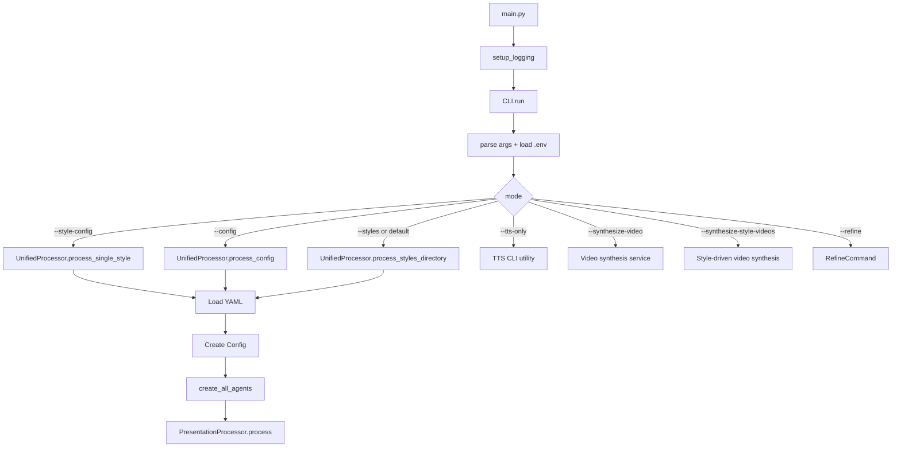
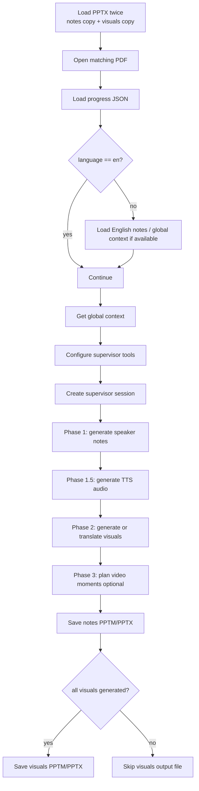
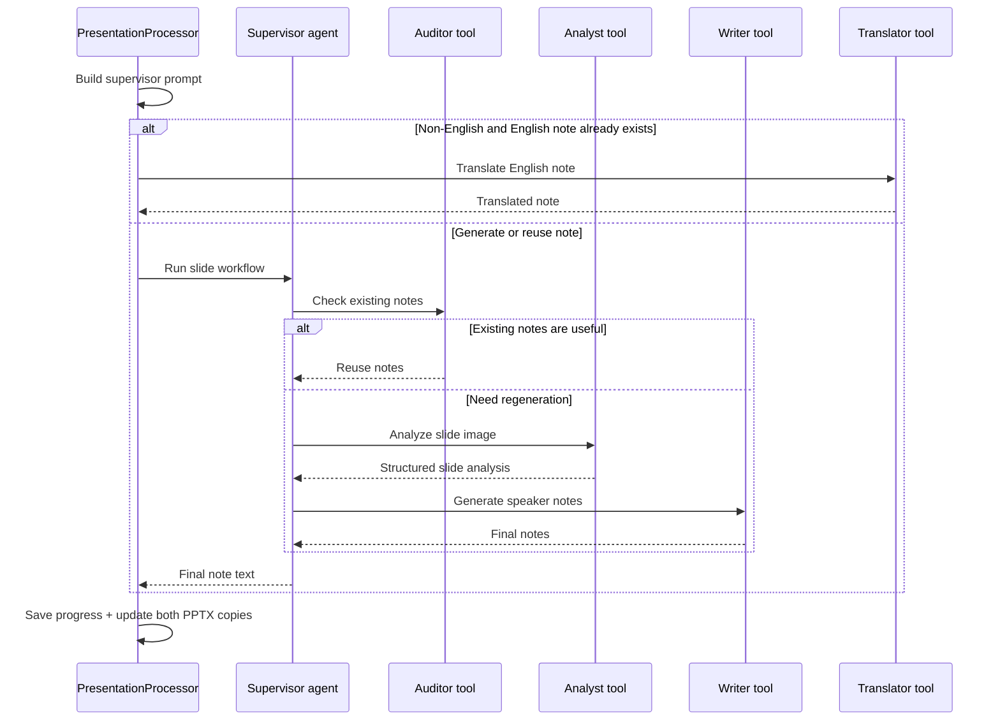
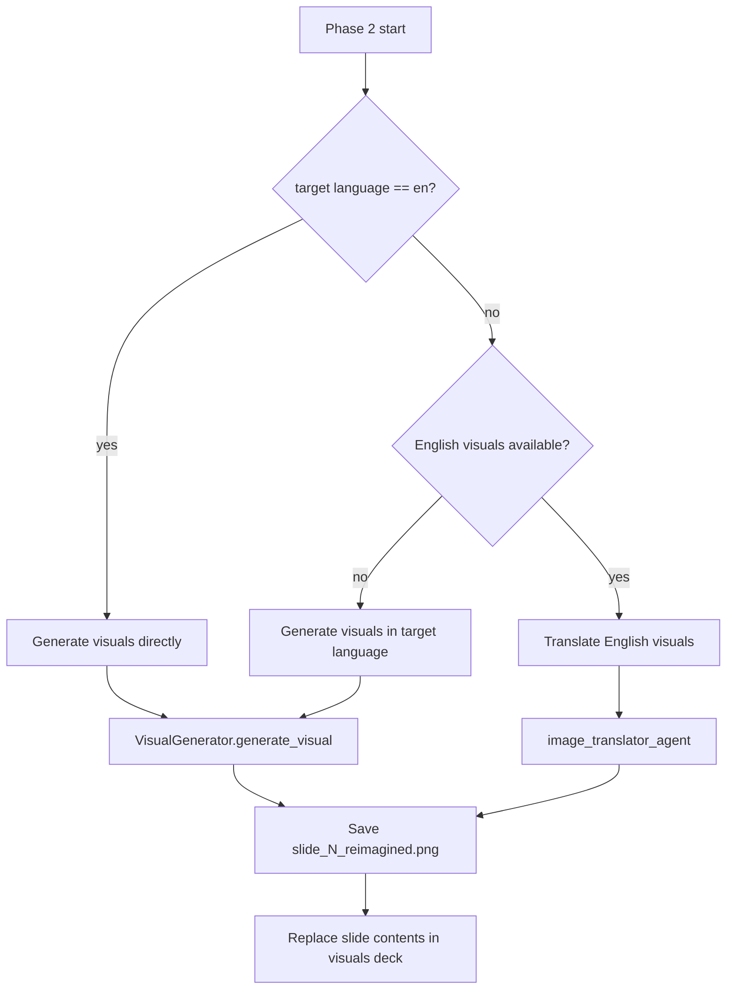

# Gemini Powerpoint Sage Architecture

This document traces the real runtime flow in the current codebase, from the CLI entry point down to slide-by-slide agent execution. It focuses on the paths implemented in:

- `main.py`
- `application/cli.py`
- `application/unified_processor.py`
- `services/presentation_processor.py`
- `services/visual_generator.py`
- `config/config.py`

## 1. Runtime entry points

The application has one executable entry point and several user-facing modes.

## 2. What each CLI mode actually does

| User command | Main handler | Purpose |
| --- | --- | --- |
| `python main.py --style-config cyberpunk` | `UnifiedProcessor.process_single_style()` | Batch process all PPTX/PDF pairs from one YAML config. |
| `python main.py --config /path/to/config.yaml` | `UnifiedProcessor.process_config()` | Run one custom YAML file directly. |
| `python main.py --styles` or `python main.py` | `UnifiedProcessor.process_styles_directory()` | Process every `styles/config.*.yaml` file. |
| `python main.py --tts-only --progress-file progress.json` | `CLI._handle_tts_only()` | Generate audio from an existing progress JSON. |
| `python main.py --synthesize-video ...` | `CLI._handle_video_synthesis()` | Combine generated visuals and audio into a video. |

## 2.5 YAML config resolution rules

`ConfigFileLoader.load_from_file()` now resolves relative paths before processing starts:

1. Config files under `styles/` resolve relative paths from the repository root.
2. Config files outside `styles/` resolve relative paths from the config file's own folder.

That keeps built-in style configs working while also making `--config /full/path/to/file.yaml` reliable, while preserving YAML as the only processing source of truth.

## 3. End-to-end processing for one presentation

Once a single presentation reaches `PresentationProcessor`, the runtime becomes a fixed multi-phase pipeline.

## 4. Phase-by-phase trace

### Phase 0: global context

`PresentationProcessor._get_global_context()` resolves presentation-wide context in this order:

1. Reuse cached context from the progress file.
2. If the target language is not English, try translating the English global context.
3. Otherwise render every PDF page to an image and call the overviewer agent once.

That global context is then reused for every slide in the same run.

### Phase 1: speaker notes

`PresentationProcessor._phase_generate_notes()` loops through each slide and keeps small rolling context:

- current slide image from the PDF
- existing slide notes
- summary of the previous slide
- last three generated speaker-note blocks
- progress status for skip/retry behavior

Each slide is routed through `_process_slide_notes()`.

### Phase 1.5: TTS

If TTS is enabled, `PresentationProcessor._phase_generate_tts()` converts successful slide notes into `SlideData` objects, sends them to the batch TTS orchestrator, then writes audio metadata back into the same progress JSON.

### Phase 2: visuals

`PresentationProcessor._phase_generate_visuals()` uses one of two branches:

For non-English runs, translated visuals are first looked up in the sibling
`*_en_visuals/` directory under the same presentation output root, then the
localized `*_visuals/` folder is used as the target for the translated result.

`VisualGenerator.generate_visual()` itself is a three-tier fallback chain:

1. primary designer agent
2. secondary Gemini image model
3. direct Imagen generation

### Phase 3: video planning + Veo generation

If `generate_videos` is enabled, `_phase_generate_videos()` asks the planner agent to pick a few high-value moments, saves a `video_plan.json` sidecar, and generates Veo clips for those moments into the `*_videos/` folder. Later synthesis inserts each clip before the matching slide segment in the final combined video. The slide deck itself is not modified.

The planner prefers:

1. an intro moment
2. a section transition if the deck has one
3. a conclusion moment

It does not create a video for every slide.

## 5. Responsibility map

| Component | Responsibility |
| --- | --- |
| `CLI` | Parse mode, enforce mutually exclusive inputs, dispatch to the correct handler. |
| `UnifiedProcessor` | Convert CLI/YAML input into `Config` + agents + `PresentationProcessor`. |
| `Config` | Resolve style, language, output folders, and artifact naming. |
| `InputScanner` | Discover PPTX/PDF pairs for YAML-driven processing. |
| `PresentationProcessor` | Orchestrate the full presentation pipeline and progress tracking. |
| `AgentToolFactory` | Expose analyst/writer/auditor/translator tools to the supervisor agent. |
| `VisualGenerator` | Generate slide images and replace slide contents in the visuals deck. |
| `TTSOrchestrator` | Batch audio generation from successful notes. |

## 6. Output model

For each presentation/language pair, the processor may create:

- `*_notes.pptx|pptm`
- `*_visuals.pptx|pptm`
- `*_progress.json`
- `*_visuals/` image directory
- `*_speech/` audio directory
- `*_videos/` video plan sidecar artifacts and Veo clip files

The exact output root depends on `Config._get_output_dir()`:

- single-file mode defaults to `generate/` next to the PPTX
- non-`professional` styles get a nested style folder
- YAML-driven runs usually honor the config file's `output_dir`

## 7. Main design takeaway

The system is best understood as:

1. **CLI routing**
2. **file discovery / config resolution**
3. **agent creation**
4. **one presentation pipeline**
5. **per-slide supervisor workflow**

If you are tracing bugs, start from the mode-specific CLI branch first, then follow the `UnifiedProcessor -> Config -> PresentationProcessor` path.
