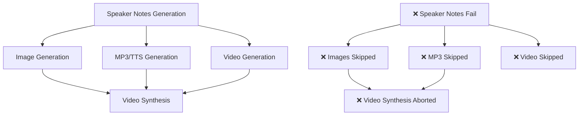

# Error Handling & Recovery Guide

This guide explains how the Gemini PowerPoint Sage handles errors, the dependency chain between processing phases, and how to recover from failures.

## 🔗 Processing Dependency Chain

The system uses a **strict dependency chain** where each phase requires the previous phase to succeed. Understanding this chain is crucial for troubleshooting errors.

### Phase Dependencies



### Detailed Dependency Rules

| Phase | Input Requirements | Success Criteria | Failure Impact |
|-------|-------------------|------------------|----------------|
| **Speaker Notes** | • PDF content<br>• Existing notes<br>• Global context | • Status = "success"<br>• Non-empty notes generated | • All downstream phases skipped<br>• Progress marked as "error" |
| **Image Generation** | • ✅ Speaker notes success<br>• Slide image from PDF | • PNG file created<br>• Visual enhancement applied | • Video synthesis missing slide<br>• Misaligned slide-audio pairing |
| **MP3/TTS Generation** | • ✅ Speaker notes success<br>• Non-empty speaker notes | • MP3 file created<br>• Audio duration > 0 | • Video synthesis missing audio<br>• Misaligned slide-audio pairing |
| **Video Generation** | • ✅ Speaker notes success<br>• Video prompts enabled | • Video prompt generated | • No impact on other phases |
| **Video Synthesis** | • ✅ ALL slides successful<br>• Equal slide/audio counts<br>• Proper file naming | • MP4 video created<br>• All segments combined | • Complete failure if any slide missing |

## 🚨 Critical Error Scenarios

### Scenario 1: Single Slide Failure

**Problem:**
```json
"slide_16_e3b0c442": {
  "slide_index": 16,
  "status": "error",
  "note": "",
  "error_message": "Supervisor returned empty response"
}
```

### Scenario 1b: Tool Error Misclassified as Success (FIXED)

**Previous Problem (Now Fixed):**
```json
"slide_60_e3b0c442": {
  "slide_index": 60,
  "status": "success",  // ❌ WRONG - Should be "error"
  "note": "Error: The writer agent failed to generate a script. Please try again or use a placeholder."
}
```

**What Was Happening:**
- Writer agent failed and returned error message
- Supervisor received non-empty text (the error message)
- System incorrectly marked as "success" because response wasn't empty
- Error messages were treated as valid speaker notes

**Fix Applied:**
- Added intelligent error detection in supervisor logic
- System now recognizes error patterns from tools
- Slides with tool errors are correctly marked as "error" status
- Error messages are no longer treated as successful speaker notes

**Impact Chain:**
1. ❌ Speaker notes fail for slide 16
2. ❌ Image generation skipped: "Skipping visual generation for Slide 16 due to notes generation failure"
3. ❌ MP3 generation skipped: Slide 16 not added to TTS queue
4. ❌ Video synthesis fails: "Number of slide images (45) must match number of audio files (45)" but misaligned

**File Structure:**
```
slides/
├── slide_1_reimagined.png  ✅
├── slide_2_reimagined.png  ✅
...
├── slide_15_reimagined.png ✅
# ❌ slide_16_reimagined.png MISSING
├── slide_17_reimagined.png ✅ (but will be paired with slide_16.mp3)
...

audio/
├── slide_1.mp3  ✅
├── slide_2.mp3  ✅
...
├── slide_15.mp3 ✅
# ❌ slide_16.mp3 MISSING
├── slide_17.mp3 ✅ (but will be paired with slide_17_reimagined.png)
...
```

**Result:** Misaligned pairing where slide 17's image is paired with slide 16's audio, creating incorrect video segments.

### Scenario 2: Multiple Slide Failures

**Problem:**
```json
"slide_5_abc123": {"status": "error"},
"slide_12_def456": {"status": "error"},
"slide_23_ghi789": {"status": "error"}
```

**Impact:**
- 3 missing images, 3 missing audio files
- Video synthesis gets 43 images and 43 audio files
- Pairing is completely misaligned after first failure

### Scenario 3: Intermittent Failures

**Problem:**
- Network timeouts during API calls
- Rate limiting from Google Cloud
- Temporary service unavailability

**Built-in Recovery:**
- Automatic retry with exponential backoff (3 attempts)
- Progress tracking allows resuming from last successful slide
- Graceful degradation with fallback mechanisms

## 🛠️ Improved Error Detection (v2.1+)

The system now includes **conservative error detection** that prevents tool errors from being misclassified as successful speaker notes while minimizing false positives:

### Design Philosophy: Conservative & Reliable

**Priority: Accuracy over Completeness**
- Uses only highly specific error patterns that are very unlikely to appear in legitimate speaker notes
- Focuses on exact tool error messages and structured formats
- Minimizes risk of flagging valid educational content as errors
- Better to miss some edge-case errors than to disrupt legitimate content

### New Structured Error Format

**Supervisor agents now use a structured format for clear error reporting:**
```
SYSTEM_ERROR: [TOOL_NAME] - [ERROR_DESCRIPTION]
DETAILS: [Specific error message from the tool]
ACTION_REQUIRED: [What needs to be done to fix this]
```

**Examples:**
```
SYSTEM_ERROR: SPEECH_WRITER - Tool returned error message
DETAILS: Error: The writer agent failed to generate a script. Please try again or use a placeholder.
ACTION_REQUIRED: Retry slide processing or investigate underlying API/network issues
```

### Error Detection Patterns

**Reliably detected as errors (high confidence patterns):**
- Structured format: `SYSTEM_ERROR:`, `TOOL_ERROR:`, `PROCESSING_ERROR:`
- Specific tool errors: `"Error: The writer agent failed to generate a script"`
- Tool placeholders: `"Please try again or use a placeholder"`
- Generation failures: `"Failed to generate a script"`, `"Tool execution failed"`
- Clear error starters: `"Error:"`, `"Failed:"`, `"Cannot generate"`
- Very short error responses: `"Error timeout"`, `"Failed processing"`

**Safely preserved as valid content:**
- `"Let's examine the error handling patterns in modern software"` ✅
- `"When troubleshooting network issues, check for timeout errors"` ✅
- `"The system failed to meet expectations, but we learned valuable lessons"` ✅
- `"Error handling is crucial for robust application development"` ✅
- `"Generation of reports failed in the old system, leading to this new approach"` ✅

### Enhanced Supervisor Prompt & Error Detection

**Supervisor Agent Improvements:**
- Uses structured error format for consistent error reporting
- Recognizes tool failure responses with high accuracy
- Does not output error messages as speaker notes
- Provides clear failure indicators for retry logic
- Requests manual intervention when tools consistently fail

**Simplified Error Detection Features:**
- **Conservative approach** - Uses only highly specific patterns to minimize false positives
- **Exact pattern matching** - Focuses on tool-specific error messages unlikely to appear in real content
- **Structured format recognition** - Detects new `SYSTEM_ERROR:` format reliably
- **Minimal false positives** - Preserves legitimate content that mentions errors in educational context
- **High reliability** - Prioritizes accuracy over completeness to avoid disrupting valid speaker notes

## 🔧 Error Recovery Strategies

### 1. Automatic Retry Configuration

**Enable in YAML Config:**
```yaml
# styles/config.*.yaml
retry_errors: true  # Force regeneration of failed slides
```

Re-run the same YAML after enabling `retry_errors: true`.

### 2. Manual Error Investigation

**Check Progress File:**
```bash
# View progress file to identify failed slides
cat notes/cyberpunk/generate/presentation_en_progress.json | jq '.slides[] | select(.status == "error")'
```

**Check Logs:**
```bash
# View detailed error logs
tail -f logs/gemini_powerpoint_sage_*.log | grep -i error
```

### 3. Targeted Recovery

**Single Config Recovery:**
```bash
# Process only the problematic YAML config
python main.py --config configs/problematic-presentation.yaml
```

**Specific Slide Investigation:**
```bash
# Enable debug logging for detailed error analysis
export LOG_LEVEL=DEBUG
python main.py --style-config cyberpunk
```

### 4. Video Synthesis Recovery

**Pre-flight Check:**
```bash
# Verify all slides have both images and audio before video synthesis
python -c "
import json
from pathlib import Path

# Load progress file
with open('notes/cyberpunk/generate/presentation_en_progress.json') as f:
    progress = json.load(f)

# Check for failures
failed_slides = []
for slide_key, slide_data in progress['slides'].items():
    if slide_data.get('status') != 'success':
        failed_slides.append(slide_data.get('slide_index', 'unknown'))

if failed_slides:
    print(f'❌ Failed slides: {failed_slides}')
    print('Fix these slides before attempting video synthesis')
else:
    print('✅ All slides successful - ready for video synthesis')
"
```

**Force Complete Regeneration:**
```bash
# Nuclear option: regenerate everything
rm notes/cyberpunk/generate/presentation_en_progress.json
python main.py --style-config cyberpunk
```

## 🛠️ Troubleshooting Common Errors

### Speaker Notes Generation Failures

**Error:** "Supervisor returned empty response"
```bash
# Solutions:
1. Check API quotas and billing
2. Verify network connectivity
3. Enable `retry_errors: true` in YAML and rerun
4. Check for rate limiting in logs
```

**Error:** Tool errors marked as "success" (Fixed in v2.1+)
```bash
# Symptoms: Progress shows "status": "success" but note contains error message
# Example: "Error: The writer agent failed to generate a script..."

# This was a critical bug where tool failures were misclassified as successful
# The system now correctly detects these patterns and marks them as "error"

# If you see this on older versions:
1. Upgrade to latest version with improved error detection
2. Set `retry_errors: true` to regenerate affected slides
3. Check logs for underlying tool failure causes (API limits, timeouts, etc.)
```

**Error:** "Translation failed for slide X"
```bash
# Solutions:
1. Ensure English baseline exists
2. Check translation service availability
3. Verify language code is supported
4. Retry with fresh English generation
```

### Image Generation Failures

**Error:** "No image generated for Slide X"
```bash
# Root cause: Speaker notes failed
# Solution: Fix speaker notes first, then retry
python main.py --style-config cyberpunk
```

### Video Synthesis Failures

**Error:** "Number of slide images (X) must match number of audio files (Y)"
```bash
# Root cause: Some slides failed in earlier phases
# Solution: Ensure ALL slides succeed before video synthesis

# 1. Check for failed slides
grep -r "status.*error" notes/*/generate/*.json

# 2. Set retry_errors: true in the affected YAML config(s)
# 3. Re-run processing
python main.py --styles

# 4. Verify all slides successful
python main.py --video-cache-stats  # Shows file counts

# 5. Attempt video synthesis
python main.py --synthesize-video --slides-dir path/to/visuals --video-output output.mp4
```

**Error:** "Missing video segment file for slide X"
```bash
# Root cause: Slide image or audio missing
# Solution: Regenerate missing components

# Check what's missing
ls -la slides_dir/
ls -la audio_dir/

# Regenerate if needed
python main.py --style-config cyberpunk
```

### Performance and Timeout Issues

**Error:** "TTS generation timed out"
```bash
# Solutions:
export TTS_TIMEOUT_SECONDS=180  # Increase timeout
python main.py --style-config cyberpunk
```

**Error:** "Video synthesis timed out"
```bash
# Solutions:
1. Use video_synthesis_wrapper.py for timeout protection
2. Process smaller batches
3. Check system resources (CPU, memory, disk space)
```

## 📊 Error Monitoring and Prevention

### Progress Monitoring

**Check Processing Status:**
```bash
# Count successful vs failed slides
python -c "
import json, glob
for file in glob.glob('notes/*/generate/*_progress.json'):
    with open(file) as f:
        data = json.load(f)
    total = len(data['slides'])
    success = sum(1 for s in data['slides'].values() if s.get('status') == 'success')
    failed = total - success
    print(f'{file}: {success}/{total} successful, {failed} failed')
"
```

**Real-time Monitoring:**
```bash
# Monitor logs in real-time
tail -f logs/gemini_powerpoint_sage_*.log | grep -E "(ERROR|WARNING|SUCCESS)"
```

### Preventive Measures

1. **Resource Management:**
   ```bash
   # Ensure adequate disk space
   df -h
   
   # Monitor memory usage
   free -h
   
   # Check API quotas
   gcloud logging read "resource.type=gce_instance" --limit=10
   ```

2. **Configuration Validation:**
   ```bash
   # Test configuration before batch processing
   python main.py --config configs/small-test.yaml
   ```

3. **Incremental Processing:**
   ```bash
   # Process one style at a time for large batches
   python main.py --style-config professional
   python main.py --style-config cyberpunk
   # Rather than: python main.py --styles
   ```

## 🔄 Recovery Workflows

### Complete Recovery Workflow

```bash
#!/bin/bash
# complete_recovery.sh - Comprehensive error recovery

echo "🔍 Checking for failed slides..."
failed_count=$(grep -r "status.*error" notes/*/generate/*.json | wc -l)

if [ $failed_count -gt 0 ]; then
    echo "❌ Found $failed_count failed slides"
    echo "🔄 Starting recovery process..."
    
    # Step 1: Ensure retry_errors: true is enabled in the affected YAML config(s)
    # Step 2: Retry failed slides
    python main.py --styles
    
    # Step 2: Verify recovery
    new_failed_count=$(grep -r "status.*error" notes/*/generate/*.json | wc -l)
    
    if [ $new_failed_count -eq 0 ]; then
        echo "✅ All slides recovered successfully"
        echo "🎬 Ready for video synthesis"
    else
        echo "⚠️  Still have $new_failed_count failed slides"
        echo "📋 Manual investigation required"
        grep -r "status.*error" notes/*/generate/*.json
    fi
else
    echo "✅ No failed slides found"
fi
```

### Video Synthesis Pre-flight Check

```bash
#!/bin/bash
# video_preflight.sh - Check readiness for video synthesis

check_presentation() {
    local slides_dir="$1"
    local audio_dir="$2"
    
    slide_count=$(find "$slides_dir" -name "*.png" -o -name "*.jpg" | wc -l)
    audio_count=$(find "$audio_dir" -name "*.mp3" | wc -l)
    
    echo "📊 $slides_dir: $slide_count slides"
    echo "🎵 $audio_dir: $audio_count audio files"
    
    if [ $slide_count -eq $audio_count ] && [ $slide_count -gt 0 ]; then
        echo "✅ Ready for video synthesis"
        return 0
    else
        echo "❌ Not ready - count mismatch or no files"
        return 1
    fi
}

# Check all presentation directories
for visuals_dir in notes/*/generate/*_visuals; do
    if [ -d "$visuals_dir" ]; then
        audio_dir="${visuals_dir%_visuals}_speech"
        if [ -d "$audio_dir" ]; then
            check_presentation "$visuals_dir" "$audio_dir"
        fi
    fi
done
```

## 📚 Related Documentation

- [Architecture Overview](ARCHITECTURE.md) - Understanding the multi-agent system
- [Video Synthesis Setup](../VIDEO_SYNTHESIS_SETUP.md) - Video processing configuration
- [Performance Caching](PERFORMANCE_CACHING.md) - Optimizing processing speed
- [Testing Guide](TESTING_GUIDE.md) - Automated testing and validation

## 🆘 Getting Help

If you encounter persistent errors:

1. **Check the logs** for detailed error messages
2. **Verify your configuration** matches the examples
3. **Test with a small presentation** first
4. **Check system resources** (disk space, memory, network)
5. **Review API quotas** and billing status
6. **Try the recovery workflows** above

For complex issues, include:
- Progress file contents (`*_progress.json`)
- Log file excerpts
- System configuration details
- Steps to reproduce the error